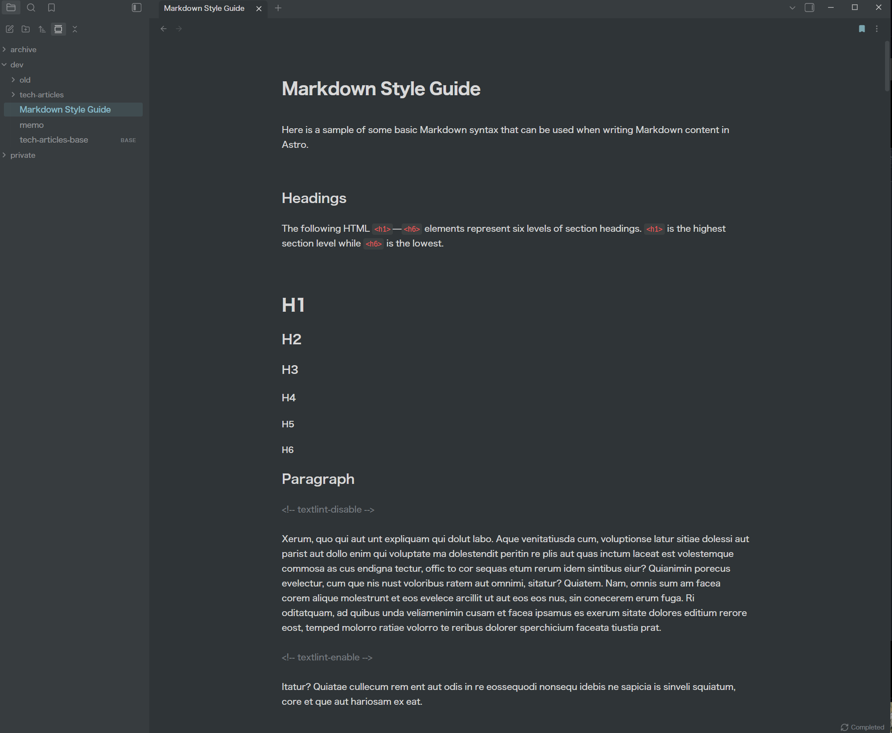
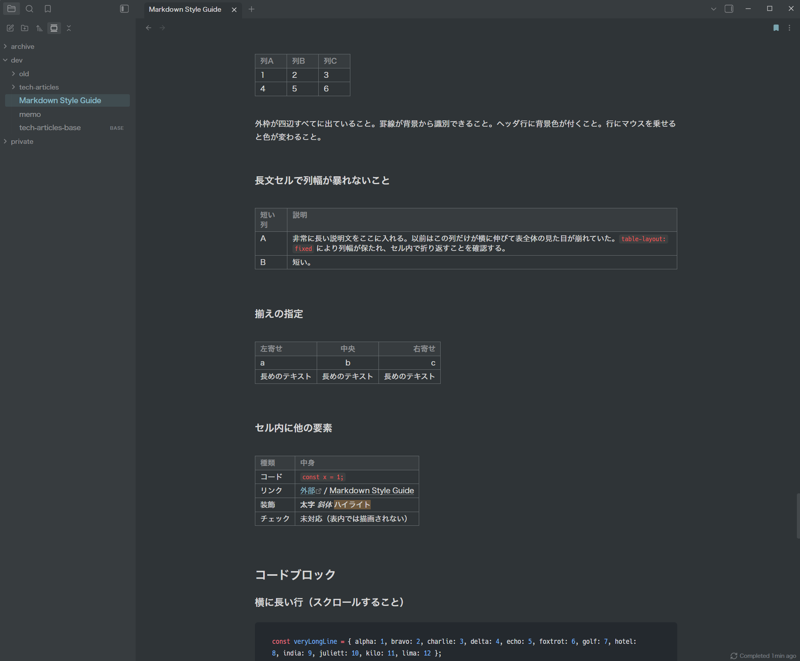

# my obsidian snippets

[English](README.md) | 日本語

Obsidian のデフォルトテーマに重ねて使う CSS スニペット集です。
本文の読みやすさを重視して、見出し・表・コードブロック・サイドバーなどの見た目を整えます。

## スクリーンショット

## インストール

1. `snippets/` 内の `.css` ファイルを、Vault の `.obsidian/snippets/` にコピーする
2. Obsidian の 設定 → 外観 → CSS スニペット で再読み込みし、**すべて** 有効にする

各ファイルは `00-tokens.css` の変数を参照しているので、一部だけ有効にすると見た目が崩れます。
ファイル名の番号は読み込み順です（Obsidian はファイル名順に読み込みます）。

## カスタマイズ

- 数値や色の調整は `00-tokens.css` だけで済むようにしています
- ダークモードの配色は `80-colors.css`
- アクセント色は Obsidian の 設定 → 外観 → アクセントカラー から変更できます

## ファイル構成

| ファイル | 内容 |
| --- | --- |
| `00-tokens.css` | 変数・デザイントークン |
| `10-app.css` | ステータスバー / タイトルバー / ウィンドウフレーム |
| `20-components.css` | モーダル / プログレスバー / ツールチップ |
| `30-content.css` | 見出し / リスト / リンク / コード / 引用 / callout / 表 |
| `40-layout.css` | ページ幅 / 余白 / 埋め込み |
| `50-extras.css` | ヘルパークラス / 画像の扱い |
| `60-interface.css` | サイドバー / タブ / 検索 / 設定 / スクロールバー |
| `70-plugins.css` | コアプラグイン（Canvas など） |
| `80-colors.css` | カラースキーム |

`markdown-stype-guide.md` は表示確認用のサンプルノートです。Vault に入れて見た目をチェックできます。

## License

MIT
