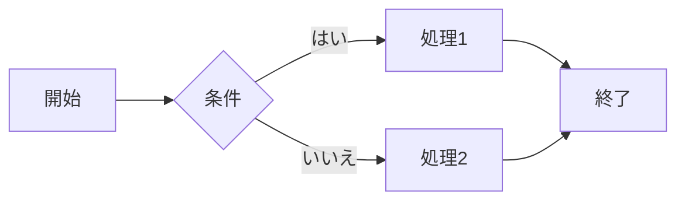

Here is a sample of some basic Markdown syntax that can be used when writing Markdown content in Astro.

## Headings

The following HTML `<h1>`—`<h6>` elements represent six levels of section headings. `<h1>` is the highest section level while `<h6>` is the lowest.

# H1

## H2

### H3

#### H4

##### H5

###### H6

## Paragraph

<!-- textlint-disable -->

Xerum, quo qui aut unt expliquam qui dolut labo. Aque venitatiusda cum, voluptionse latur sitiae dolessi aut parist aut dollo enim qui voluptate ma dolestendit peritin re plis aut quas inctum laceat est volestemque commosa as cus endigna tectur, offic to cor sequas etum rerum idem sintibus eiur? Quianimin porecus evelectur, cum que nis nust voloribus ratem aut omnimi, sitatur? Quiatem. Nam, omnis sum am facea corem alique molestrunt et eos evelece arcillit ut aut eos eos nus, sin conecerem erum fuga. Ri oditatquam, ad quibus unda veliamenimin cusam et facea ipsamus es exerum sitate dolores editium rerore eost, temped molorro ratiae volorro te reribus dolorer sperchicium faceata tiustia prat.

<!-- textlint-enable -->

Itatur? Quiatae cullecum rem ent aut odis in re eossequodi nonsequ idebis ne sapicia is sinveli squiatum, core et que aut hariosam ex eat.

## Images

#### Syntax

```markdown

```

#### Output


## Blockquotes

<!-- textlint-disable -->

The blockquote element represents content that is quoted from another source, optionally with a citation which must be within a `footer` or `cite` element, and optionally with in-line changes such as annotations and abbreviations.

<!-- textlint-enable -->

### Blockquote without attribution

#### Syntax

```markdown
> Tiam, ad mint andaepu dandae nostion secatur sequo quae.
> **Note** that you can use _Markdown syntax_ within a blockquote.
```

#### Output

> Tiam, ad mint andaepu dandae nostion secatur sequo quae.
> **Note** that you can use _Markdown syntax_ within a blockquote.

### Blockquote with attribution

#### Syntax

```markdown
> Don't communicate by sharing memory, share memory by communicating.<br>
> — <cite>Rob Pike[^1]</cite>
```

#### Output

> Don't communicate by sharing memory, share memory by communicating.<br>
> — <cite>Rob Pike[^1]</cite>

[^1]: The above quote is excerpted from Rob Pike's [talk](https://www.youtube.com/watch?v=PAAkCSZUG1c) during Gopherfest, November 18, 2015.

## Tables

#### Syntax

```markdown
| Italics   | Bold     | Code   |
| --------- | -------- | ------ |
| _italics_ | **bold** | `code` |
```

#### Output

| Italics   | Bold     | Code   |
| --------- | -------- | ------ |
| _italics_ | **bold** | `code` |

## Code Blocks

#### Syntax

<!-- textlint-disable -->

we can use 3 backticks ``` in new line and write snippet and close with 3 backticks on new line and to highlight language specific syntac, write one word of language name after first 3 backticks, for eg. html, JavaScript, css, markdown, TypeScript, txt, bash

<!-- textlint-enable -->

````markdown
```html sample.html
<!doctype html>
<html lang="en">
  <head>
    <meta charset="utf-8" />
    <title>Example HTML5 Document</title>
  </head>
  <body>
    <p>Test</p>
  </body>
</html>
```
````

Output

```html sample.html
<!doctype html>
<html lang="en">
  <head>
    <meta charset="utf-8" />
    <title>Example HTML5 Document</title>
  </head>
  <body>
    <p>Test</p>
  </body>
</html>
```

## List Types

### Ordered List

#### Syntax

```markdown
1. First item
2. Second item
3. Third item
```

#### Output

1. First item
2. Second item
3. Third item

### Unordered List

#### Syntax

```markdown
- List item
- Another item
- And another item
```

#### Output

- List item
- Another item
- And another item

### Nested list

#### Syntax

```markdown
- Fruit
  - Apple
  - Orange
  - Banana
- Dairy
  - Milk
  - Cheese
```

#### Output

- Fruit
  - Apple
  - Orange
  - Banana
- Dairy
  - Milk
  - Cheese

## Other Elements — abbr, sub, sup, kbd, mark

#### Syntax

```markdown
<abbr title="Graphics Interchange Format">GIF</abbr> is a bitmap image format.

H<sub>2</sub>O

X<sup>n</sup> + Y<sup>n</sup> = Z<sup>n</sup>

Press <kbd><kbd>CTRL</kbd>+<kbd>ALT</kbd>+<kbd>Delete</kbd></kbd> to end the session.

Most <mark>salamanders</mark> are nocturnal, and hunt for insects, worms, and other small creatures.
```

#### Output

<abbr title="Graphics Interchange Format">GIF</abbr> is a bitmap image format.

H<sub>2</sub>O

X<sup>n</sup> + Y<sup>n</sup> = Z<sup>n</sup>

Press <kbd><kbd>CTRL</kbd>+<kbd>ALT</kbd>+<kbd>Delete</kbd></kbd> to end the session.

Most <mark>salamanders</mark> are nocturnal, and hunt for insects, worms, and other small creatures.
---

# テーマ検証用（Obsidian 固有の記法）

ここから下は、CSS スニペットが壊れていないかを目視で確認するための見本です。
**編集モードと閲覧モードの両方**で見ること。

## Callouts

### 組み込みの全種類

> [!note] Note
> 既定のタイプ。左のアイコンと色が種類ごとに変わる。

> [!abstract] Abstract / Summary / TLDR
> 本文。

> [!info] Info
> 本文。

> [!todo] Todo
> 本文。

> [!tip] Tip / Hint / Important
> 本文。

> [!success] Success / Check / Done
> 本文。

> [!question] Question / Help / FAQ
> 本文。

> [!warning] Warning / Caution / Attention
> 本文。

> [!failure] Failure / Fail / Missing
> 本文。

> [!danger] Danger / Error
> 本文。

> [!bug] Bug
> 本文。

> [!example] Example
> 本文。

> [!quote] Quote / Cite
> 本文。

### タイトルだけ

> [!info] タイトルのみで本文なし

### 折りたたみ

> [!tip]- 初期状態が閉じている（`-`）
> 開くとこの本文が見える。折りたたみの矢印とアニメーションを確認する。

> [!tip]+ 初期状態が開いている（`+`）
> 閉じられることを確認する。

### 入れ子と、中に他の要素を入れた場合

> [!warning] 外側の callout
> 段落テキスト。
>
> > [!note] 内側の callout
> > 入れ子でも余白が破綻しないこと。
>
> - リストも入る
> - 2 つめの項目
>
> | 表 | も |
> | --- | --- |
> | 入る | こと |
>
> ```js
> // コードブロックも入る
> const x = 1;
> ```

## タスクリスト

チェックボックスが**四角**であること。

- [ ] 未完了のタスク
- [x] 完了したタスク
- [ ] 親タスク
    - [x] 子タスク（完了）
    - [ ] 子タスク（未完了）
- [ ] とても長いテキストのタスク。折り返したときに 2 行目がチェックボックスの下に潜り込まず、テキストの左端に揃うことを確認する。

## リンクとタグ

- 内部リンク: [[Markdown Style Guide]]（本文色＋下線）
- 見出しへの内部リンク: [[Markdown Style Guide#Tables]]
- 存在しないノートへのリンク: [[存在しないノート]]（未解決リンクの色）
- 外部リンク: [Obsidian 公式](https://obsidian.md)（アクセント色＋下線）
- 素の URL: https://obsidian.md
- タグ: #dev （pill 表示になること）

## 埋め込み（transclusion）

枠・背景・タイトルが出ず、親ノートと地続きに見えること。ホバーすると右上に元ノートへのリンクが薄く出る。

![[Markdown Style Guide#Blockquote without attribution]]

## 強調と装飾

通常のテキスト、**太字**、*斜体*、***太字斜体***、~~打ち消し線~~、==ハイライト==、`インラインコード`（朱色）、そして [リンク](https://obsidian.md) が同じ行に混在した場合の行間と揃いを確認する。

%%この行はコメントなので閲覧モードでは表示されない%%

## 水平線

上の段落と下の段落の間隔を確認する。

---

下の段落。

## 表

### 外枠・罫線・ヘッダ背景

| 列A | 列B | 列C |
| --- | --- | --- |
| 1   | 2   | 3   |
| 4   | 5   | 6   |

外枠が四辺すべてに出ていること。罫線が背景から識別できること。ヘッダ行に背景色が付くこと。行にマウスを乗せると色が変わること。

### 長文セルで列幅が暴れないこと

| 短い列 | 説明                                                                                                                                                               |
| ------ | ------------------------------------------------------------------------------------------------------------------------------------------------------------------ |
| A      | 非常に長い説明文をここに入れる。以前はこの列だけが横に伸びて表全体の見た目が崩れていた。`table-layout: fixed` により列幅が保たれ、セル内で折り返すことを確認する。 |
| B      | 短い。                                                                                                                                                             |

### 揃えの指定

| 左寄せ         |      中央      |         右寄せ |
| :------------- | :------------: | -------------: |
| a              |       b        |              c |
| 長めのテキスト | 長めのテキスト | 長めのテキスト |

### セル内に他の要素

| 種類     | 中身                                                   |
| -------- | ------------------------------------------------------ |
| コード   | `const x = 1;`                                         |
| リンク   | [外部](https://obsidian.md) / [[Markdown Style Guide]] |
| 装飾     | **太字** *斜体* ==ハイライト==                         |
| チェック | 未対応（表内では描画されない）                         |

## コードブロック

### 横に長い行（スクロールすること）

```js
const veryLongLine = { alpha: 1, bravo: 2, charlie: 3, delta: 4, echo: 5, foxtrot: 6, golf: 7, hotel: 8, india: 9, juliett: 10, kilo: 11, lima: 12 };
```

### 言語なし

```
プレーンなコードブロック。
シンタックスハイライトが効かない場合の背景と余白を確認する。
```

### インデントされたコードブロック

- リストの中の項目
    ```py
    def hello():
        return "world"
    ```
- 次の項目

## 数式

インライン数式 $e^{i\pi} + 1 = 0$ を含む段落。

$$
\frac{\partial u}{\partial t} = h^2 \left( \frac{\partial^2 u}{\partial x^2} + \frac{\partial^2 u}{\partial y^2} \right)
$$

## Mermaid



## 見出し直後の要素

### 見出しのすぐ下に表

| a   | b   |
| --- | --- |
| 1   | 2   |

### 見出しのすぐ下にリスト

- 項目
- 項目

### 見出しのすぐ下にコード

```sh
echo "hello"
```

## 確認チェックリスト

このノートを開いて、次を目視する。

- [ ] H1〜H6 のサイズ差がはっきりしている
- [ ] 見出し行をクリックしても `#` でテキストが左右にずれない
- [ ] 本文が中央寄せで、ウィンドウを最大化しても幅が広がりすぎない
- [ ] リストの `・` と番号がはっきり見える
- [ ] チェックボックスが四角
- [ ] インラインコードが朱色
- [ ] 引用が左の太いバーのみ（背景なし）
- [ ] callout が全種類とも崩れず、折りたたみが動く
- [ ] 表に外枠があり、罫線が背景から識別できる
- [ ] 長文セルで列幅が広がらない
- [ ] 埋め込みが親ノートと地続きに見える
- [ ] テキストカーソルが太く、点滅がゆっくり
- [ ] サイドバーで選択中のファイルがアクセント色の薄い面になる
- [ ] タブの hover が淡いグレー（アクセント色のベタ塗りではない）
- [ ] サイドバーとタブの境目に常時の縦線が出ていない

> [!note] 幅の逃がし道
> 表が広くて 54rem に収まらないノートでは、frontmatter に `cssclasses: [wide]`
> または `[max]` を書くと本文幅を広げられる。このノートでは指定していない。
